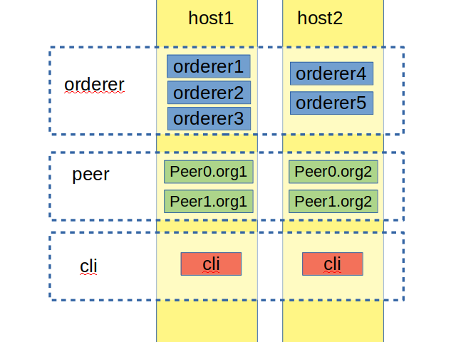

# 1. 环境准备
## 1.1 GO安装
官网下载GO安装包，然后执行下面命令，最后能够正确获得GO的版本即可
```
sudo tar -C /usr/local -xzf /home/user/go1.13.5.linux-amd64.tar.gz
sudo chown -R <用户名>:<用户组> /usr/local/go
echo 'GOPATH=\"/usr/local/go\"' >> ~/.profile
echo 'PATH=\"$PATH:/usr/local/go/bin\"' >> ~/.profile
source ~/.profile
go version
```
## 1.2 Docker安装
```
sudo apt update
sudo apt install -y apt-transport-https ca-certificates curl software-properties-common
curl -fsSL https://download.daocloud.io/docker/linux/ubuntu/gpg | sudo apt-key add -
sudo add-apt-repository "deb [arch=$(dpkg --print-architecture)] https://download.daocloud.io/docker/linux/ubuntu $(lsb_release -cs) stable"
sudo apt update
sudo apt install -y -q docker-ce=*
sudo systemctl start docker
sudo systemctl enable docker

#将用户加入Docker组
sudo usermod -a -G docker `whoami`

#更改Docker源到Daocloud
url -sSL https://get.daocloud.io/daotools/set_mirror.sh | sh -s http://f1361db2.m.daocloud.io

#重启Docker
sudo systemctl restart docker
```
完成以上操作后，需要退出ssh，重新连接以完成docker用户组的授权，后面就不需要使用sudo命令操作docker了
## 1.3 Docker-compose安装
```
curl -L https://get.daocloud.io/docker/compose/releases/download/1.12.0/docker-compose-Linux-x86_64 > ./tmp
sudo mv tmp /usr/local/bin/docker-compose
sudo chmod +x /usr/local/bin/docker-compose
```

## 1.4 Fabric基础组件准备
参考官方文档，这里不说了

# 2. 搭建方法
## 2.1 简介
采用2台机器，使用5个orderer做Raft共识，3个部署在host1(192.168.121.63)，2个部署在host2(192.168.121.84)上，设置2个组织，分别拥有2个peer，各自部署在不同的host上，每台host配置一个cli作为管理工具，整体节点分布如下图：
[]
## 2.2 网络准备（关键步骤）
由于节点是部署在不同的主机上的，而Fabric的组件是以docker形式启动的，组件之间不能直接通过网络发现各自的存在，需要使用docker构建overlay网络实现组件间的通信

在host1中执行以下命令创建overlay网络
```
docker swarm init --advertise-addr 192.168.121.63
``` 
在host1中执行以下获取overlay网络的manager token
```
docker swarm　join-token manager
``` 
在host2中执行上述命令输出的提示，加入刚刚创建的overlay网络
```
 docker swarm join --token SWMTKN-1-3cxwoofd8jugdhpwapry6g168057mg9pw1jzx96mag00pguaod-cbaw5ib6fqeuh2s8rtbsy2mp6 192.168.121.63:2377 --advertise-addr 192.168.121.84
```
在host1中执行以下命令
```
docker network create --attachable --driver overlay multinode
```
成功后，在host1和host2中输入`docker network ls`都能查询到以下结果
```
NETWORK ID          NAME                DRIVER              SCOPE
......
ufwa4qryzeg6        multinode       overlay             swarm
......
```
# 3. docker-compose配置文件
host1配置文件：
```
version: '2'

volumes:
  orderer.example.com:
  orderer2.example.com:
  orderer3.example.com:
  peer0.org1.example.com:
  peer1.org1.example.com:

networks:
  byfn:
    external:
      name: first-network

services:

  orderer.example.com:
    extends:
      file:   base/docker-compose-base.yaml
      service: orderer.example.com
    container_name: orderer.example.com
    networks:
      - byfn

  orderer2.example.com:
    extends:
      file:   base/docker-compose-base.yaml
      service: orderer2.example.com
    container_name: orderer2.example.com
    networks:
      - byfn

  orderer3.example.com:
    extends:
      file:   base/docker-compose-base.yaml
      service: orderer3.example.com
    container_name: orderer3.example.com
    networks:
      - byfn

  peer0.org1.example.com:
    container_name: peer0.org1.example.com
    extends:
      file:  base/docker-compose-base.yaml
      service: peer0.org1.example.com
    networks:
      - byfn

  peer1.org1.example.com:
    container_name: peer1.org1.example.com
    extends:
      file:  base/docker-compose-base.yaml
      service: peer1.org1.example.com
    networks:
      - byfn

  cli:
    container_name: cli
    image: hyperledger/fabric-tools:$IMAGE_TAG
    tty: true
    stdin_open: true
    environment:
      - SYS_CHANNEL=$SYS_CHANNEL
      - GOPATH=/opt/gopath
      - CORE_VM_ENDPOINT=unix:///host/var/run/docker.sock
      #- FABRIC_LOGGING_SPEC=DEBUG
      - FABRIC_LOGGING_SPEC=INFO
      - CORE_PEER_ID=cli
      - CORE_PEER_ADDRESS=peer0.org1.example.com:7051
      - CORE_PEER_LOCALMSPID=Org1MSP
      - CORE_PEER_TLS_ENABLED=true
      - CORE_PEER_TLS_CERT_FILE=/opt/gopath/src/github.com/hyperledger/fabric/peer/crypto/peerOrganizations/org1.example.com/peers/peer0.org1.example.com/tls/server.crt
      - CORE_PEER_TLS_KEY_FILE=/opt/gopath/src/github.com/hyperledger/fabric/peer/crypto/peerOrganizations/org1.example.com/peers/peer0.org1.example.com/tls/server.key
      - CORE_PEER_TLS_ROOTCERT_FILE=/opt/gopath/src/github.com/hyperledger/fabric/peer/crypto/peerOrganizations/org1.example.com/peers/peer0.org1.example.com/tls/ca.crt
      - CORE_PEER_MSPCONFIGPATH=/opt/gopath/src/github.com/hyperledger/fabric/peer/crypto/peerOrganizations/org1.example.com/users/Admin@org1.example.com/msp
    working_dir: /opt/gopath/src/github.com/hyperledger/fabric/peer
    command: /bin/bash
    volumes:
        - /var/run/:/host/var/run/
        - ./../chaincode/:/opt/gopath/src/github.com/chaincode
        - ./crypto-config:/opt/gopath/src/github.com/hyperledger/fabric/peer/crypto/
        - ./scripts:/opt/gopath/src/github.com/hyperledger/fabric/peer/scripts/
        - ./channel-artifacts:/opt/gopath/src/github.com/hyperledger/fabric/peer/channel-artifacts
    depends_on:
      - orderer.example.com
      - peer0.org1.example.com
      - peer1.org1.example.com
    networks:
      - byfn
```
host2配置文件:
```
version: '2'

volumes:
  orderer4.example.com:
  orderer5.example.com:
  peer0.org2.example.com:
  peer1.org2.example.com:

networks:
  byfn:
    external:
      name: first-network

services:

  orderer4.example.com:
    extends:
      file:   base/docker-compose-base.yaml
      service: orderer4.example.com
    container_name: orderer4.example.com
    networks:
      - byfn

  orderer5.example.com:
    extends:
      file:   base/docker-compose-base.yaml
      service: orderer5.example.com
    container_name: orderer5.example.com
    networks:
      - byfn

  peer0.org2.example.com:
    container_name: peer0.org2.example.com
    extends:
      file:  base/docker-compose-base.yaml
      service: peer0.org2.example.com
    networks:
      - byfn

  peer1.org2.example.com:
    container_name: peer1.org2.example.com
    extends:
      file:  base/docker-compose-base.yaml
      service: peer1.org2.example.com
    networks:
      - byfn

  cli:
    container_name: cli
    image: hyperledger/fabric-tools:$IMAGE_TAG
    tty: true
    stdin_open: true
    environment:
      - SYS_CHANNEL=$SYS_CHANNEL
      - GOPATH=/opt/gopath
      - CORE_VM_ENDPOINT=unix:///host/var/run/docker.sock
      #- FABRIC_LOGGING_SPEC=DEBUG
      - FABRIC_LOGGING_SPEC=INFO
      - CORE_PEER_ID=cli
      - CORE_PEER_ADDRESS=peer0.org2.example.com:9051
      - CORE_PEER_LOCALMSPID=Org2MSP
      - CORE_PEER_TLS_ENABLED=true
      - CORE_PEER_TLS_CERT_FILE=/opt/gopath/src/github.com/hyperledger/fabric/peer/crypto/peerOrganizations/org2.example.com/peers/peer0.org2.example.com/tls/server.crt
      - CORE_PEER_TLS_KEY_FILE=/opt/gopath/src/github.com/hyperledger/fabric/peer/crypto/peerOrganizations/org2.example.com/peers/peer0.org2.example.com/tls/server.key
      - CORE_PEER_TLS_ROOTCERT_FILE=/opt/gopath/src/github.com/hyperledger/fabric/peer/crypto/peerOrganizations/org2.example.com/peers/peer0.org2.example.com/tls/ca.crt
      - CORE_PEER_MSPCONFIGPATH=/opt/gopath/src/github.com/hyperledger/fabric/peer/crypto/peerOrganizations/org2.example.com/users/Admin@org2.example.com/msp
    working_dir: /opt/gopath/src/github.com/hyperledger/fabric/peer
    command: /bin/bash
    volumes:
        - /var/run/:/host/var/run/
        - ./../chaincode/:/opt/gopath/src/github.com/chaincode
        - ./crypto-config:/opt/gopath/src/github.com/hyperledger/fabric/peer/crypto/
        - ./scripts:/opt/gopath/src/github.com/hyperledger/fabric/peer/scripts/
        - ./channel-artifacts:/opt/gopath/src/github.com/hyperledger/fabric/peer/channel-artifacts
    depends_on:
      - orderer4.example.com
      - orderer5.example.com
      - peer0.org2.example.com
      - peer1.org2.example.com
    networks:
      - byfn
```
其他准备工作与官方文档单机部署一致，这里不再多说，然后就分别在host1和host2上启动docker镜像即可
